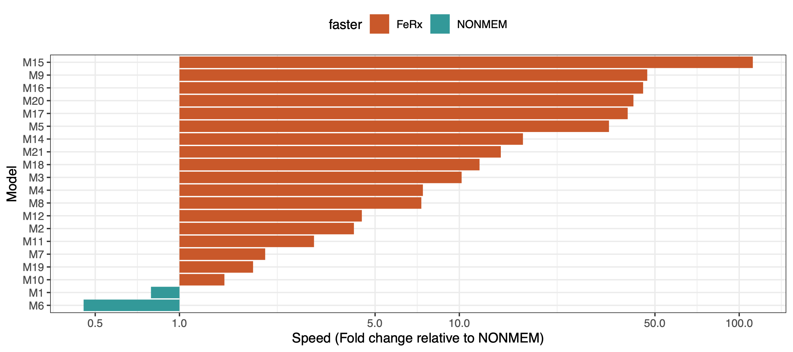

In early June I posted the first announcement of a new open source NLME engine for PK/PD analyses, FeRx. We've had a ton of positive reactions on this announcement, which strengthened our intention to continue to develop it into a production-grade, fully-featured software. The release of version 0.4.0 brings significant progress toward that goal. I'll give a brief rundown, with pointers to the documentation.

## New features

Because of the maturity of FeRx's core engine, especially FOCEI and SAEM, we've recently started focusing on auxiliary modeling tools. For example, in this new release you will find tools for [automated model building](https://ferx-nlme.org/ferx-core/tools/amd.html) (using the same [model feature language (MFL)](https://ferx-nlme.org/ferx-core/tools/search.html#the-search-space-mfl) as introduced in [Pharmpy](https://pharmpy.github.io/latest/mfl.html)), as well as [global search algorithms](https://ferx-nlme.org/ferx-core/tools/global-search.html) as for example available in [pyDarwin](https://certara.github.io/pyDarwin/html/index.html). Combined with the increased speed of the engine, model searches are now a breeze. We also added [GAM covariate screening](https://ferx-nlme.org/ferx-core/tools/gam-screening.html) and [bootstrap](https://ferx-nlme.org/ferx-core/tools/bootstrap.html) tools, as well as improvements to the VPC (e.g. [propensity-score matching](https://ferx-nlme.org/ferx-core/api/simulation.html#simulate_with_options-propensity-score-matching)).

We've added support for [survival (TTE) models](https://ferx-nlme.org/ferx-core/model-file/event-model.html), [stiff ODE solvers](https://ferx-nlme.org/ferx-core/model-file/ode-models.html#solver-details), [mixture models](https://ferx-nlme.org/ferx-core/estimation/mixture.html), and [Markov models](https://ferx-nlme.org/ferx-core/estimation/ctmm.html).

We have also beefed up FeRx's [simulation](https://ferx-nlme.org/ferx-book/chapters/11-simulation.html) capabilities; for example, it can now run adaptive simulations. The goal for our simulation engine is to ensure there is never a need to translate your model to mrgsolve or other simulation-specific software after your modeling is done, which is one of the most common bottlenecks experienced with current NLME engines.

## Optimization / speed

We've made many updates to the computation of the analytical gradients that power the search algorithms, and made their re-use across the optimization more efficient. We dropped the off-the-shelf Enzyme library in favor of hand-rolled analytical gradients. FOCEI is now even faster than before, and more accurate (often an order of magnitude or more faster than NONMEM, single-threaded).

SAEM also got a speed boost and is now about 5x faster than NONMEM on average, mainly due to the implementation of [f-SAEM](https://www.sciencedirect.com/science/article/abs/pii/S0167947319301483), but also through refactoring of its implementation.

The computation of confidence intervals from the covariance matrix has had an upgrade, and is now faster and more accurate. See [this paper](https://www.biorxiv.org/content/10.64898/2026.07.09.737434v1) for details.

Many settings are now optimized automatically depending on the dataset or the model, such as the optimizer, the choice of ODE solver, and tolerances.

## Syntax & documentation

We implemented a novel and easier [syntax for the covariate model](https://ferx-nlme.org/ferx-core/model-file/covariate-model.html). This serves two purposes. First, it is now easier for a modeler to separate the structural model from the covariate model, which also helps in communicating the model to others. Second, it allows safer and more structured implementation of covariate models and covariate searches. Most existing search tools add or remove covariate effects by regex'ing the model text; FeRx's new syntax avoids this, so covariate effects can be added and removed programmatically. It is still possible to implement covariate models in the "classic" way, of course.

We've also added syntax that makes it extremely easy to define [priors on model parameters](https://ferx-nlme.org/ferx-core/estimation/priors.html).

As outlined in our [design philosophy](https://ferx-nlme.org/design.html), we spend a lot of effort ensuring the documentation is up-to-date, complete, and easy to read. Our [practical book on working with FeRx from R](https://ferx-nlme.org/ferx-book/) was fully revised.

Our new URL is live: please update your bookmarks to [ferx-nlme.org](https://ferx-nlme.org)!

## Benchmarks

The plot below shows the speed of estimation in FeRx compared to NONMEM (v7.6.0, gfortran on Linux), both softwares single-threaded on an AMD Ryzen 7, using default settings for either software. These runs were all on real (final) PK models and datasets, not simulated scenarios. On average, models run about 10x faster in FeRx under FOCEI (slightly slower for some still, but up to 100x faster for others). SAEM is also generally much faster in FeRx. While being much faster, FeRx maintains accuracy: they reach the same minima as NONMEM. More detailed results will be shown at ACoP in October.

{fig-alt="Horizontal bar chart of FOCEI estimation speed, FeRx relative to NONMEM, for 20 real PK models on a log scale from 0.5 to 100. FeRx is faster for 18 models, up to about 110-fold for M15; NONMEM is faster for M1 (about 0.8) and M6 (about 0.45)."}

<!-- TODO: add SAEM benchmark plot:
{fig-alt="..."}
-->

A [full log of changes](https://ferx-nlme.org/changelog.html) is always available on ferx-nlme.org. Please give FeRx a spin and let us know what you think!
