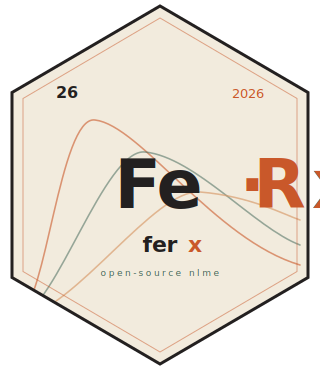

::: {.hero-banner}
::: {.container}

::: {.hero-grid}
::: {.hero-left}

::: {.wordmark}
Fe[·]{.dot}[R[*x*]{style="font-style:italic"}]{.rx}
:::

### A nonlinear mixed-effects engine for *pharmacometrics*, written in Rust. {.headline}

::: {.lede}
ferx fits models defined in comprehensible syntax, using state-of-art algorithms powered by a Rust backend. In any data science environment.
:::

::: {.meta}
[**MIT** — license]{}
:::

:::

:::

:::
:::
:::

::: {.container style="padding: 1rem 1rem;"}
::: {.built-grid style="display:grid; grid-template-columns: minmax(0, 1fr) minmax(0, 240px); gap: 2rem; align-items: center;"}

::: {.built-text}
## How ferx is built

**ferx-core** is the Rust engine — it parses `.ferx` model files, runs the
estimators, and produces fits. All numerical work happens here. It ships with a standalone
command-line tool (the `ferx` CLI) that reads a `.ferx` file plus a CSV
dataset and writes results to disk, so you can use the engine directly with
no R involved.

**ferx-r** is a thin R wrapper around `ferx-core`. It exposes the same engine
through R functions, hands `data.frame`s to the core, and returns fit
objects you can pipe into R's plotting and reporting ecosystem.

Because `ferx-core` is a stable library, you (or anyone else) can build a different
wrapper on top of it — Python, Julia, a web service — and get the exact
same numerical results as the CLI and ferx-r.
:::

::: {.sticker-stage-inline}
{.sticker-sm}
:::

:::
:::

::: {.container style="padding: 3rem 1rem 2rem;"}
## Learn ferx

::: {.resource-grid style="display:grid; grid-template-columns: repeat(auto-fit, minmax(220px, 1fr)); gap: 1.25rem; margin-top: 1rem;"}

::: {.resource-card style="border: 1px solid var(--bs-border-color); border-radius: 8px; padding: 1.25rem;"}
**[Get started](get-started.qmd)**\
Install ferx and run the warfarin quickstart in under five minutes.
:::

::: {.resource-card style="border: 1px solid var(--bs-border-color); border-radius: 8px; padding: 1.25rem;"}
**[ferx-r](https://ferx-nlme.github.io/ferx-book/)**\
Introduction to FeRx and guide for working with FeRx from R.
:::

::: {.resource-card style="border: 1px solid var(--bs-border-color); border-radius: 8px; padding: 1.25rem;"}
**[ferx-core](https://ferx-nlme.github.io/ferx-core/)**\
Guiden and reference for working with FeRx using the CLI or Rust library.
:::

::: {.resource-card style="border: 1px solid var(--bs-border-color); border-radius: 8px; padding: 1.25rem;"}
**[Reference](reference/index.html)**\
Function-level documentation for every exported function in the ferx R package.
:::

:::
:::
